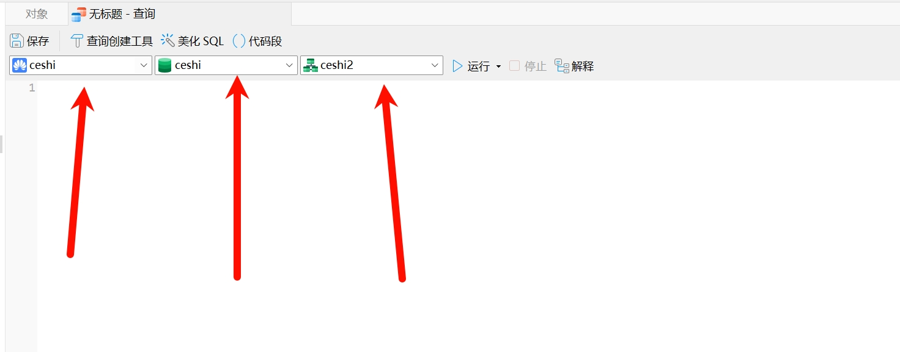

由于Gauss中默认不支持 tinyint 字段类型，当数据库中有字段是 tinyint 时，并且执行查询语句，会报错 

```
DO
$$
    DECLARE
        alter_stmt TEXT;
    BEGIN
        FOR alter_stmt IN
            SELECT 'ALTER TABLE ' || table_schema || '.' || table_name ||
                   ' ALTER COLUMN ' || column_name || ' TYPE integer USING ' || column_name || '::integer;'
            FROM information_schema.columns
            WHERE udt_name = 'int1'
              AND table_schema = 'ceshi2'
            LOOP
                EXECUTE alter_stmt; -- 动态执行生成的 ALTER TABLE 语句
            END LOOP;
    END
$$;
由于gauss会将tinyint 存储为 int1 所以查询条件是 查询int1的
 AND table_schema = 'ceshi2'，这个是具体到那个库，如果不加就将整个全部改
```



注意要gauss跟mysql不一样，一定要选好路径

