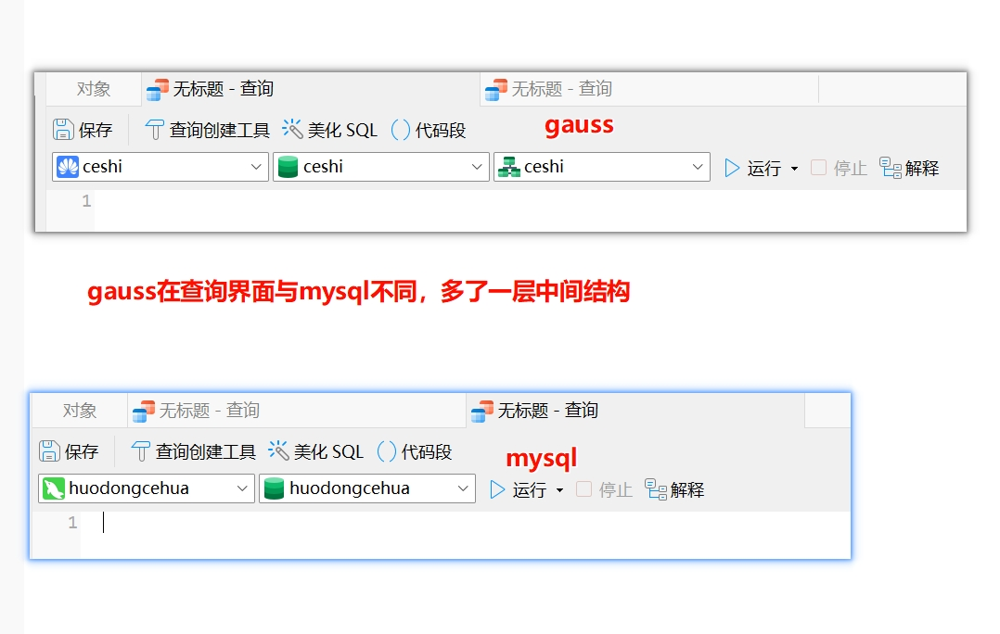
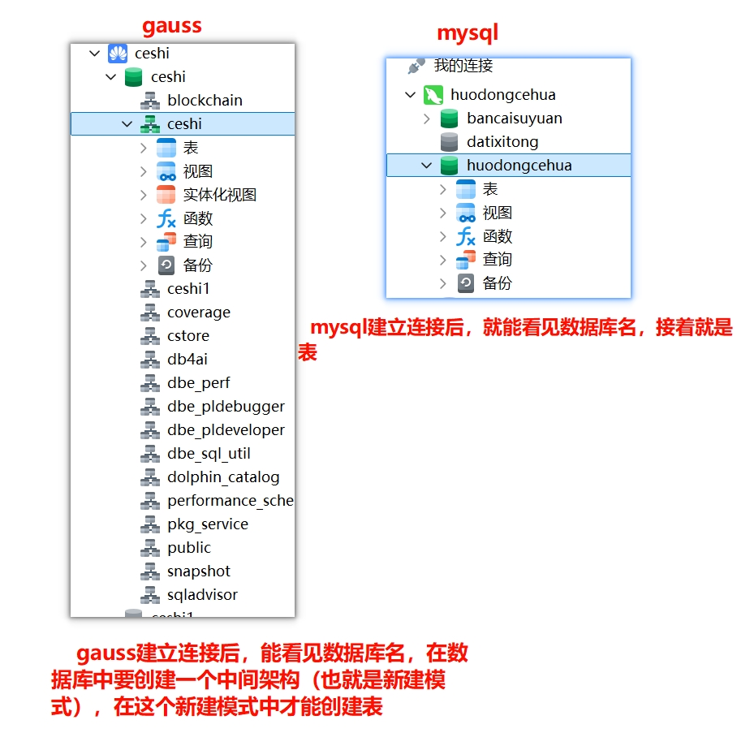

这里以Navicat为例：

# 第一步


点击连接，选择PostgreSql，选择华为云数据库，点击下一步。

# 第二步


连接名称根据自己的需要取，主机名是自己的服务器地址，端口默认5432如果自己部署的时候改变了端口，需要填写修改后的，

用户名默认gaussdb，密码是自己设置的。

# 第三步


填写完整后点击测试连接，查看是否能测试通过。

# 第四步


与gauss建立连接后，右键命令界面，

```
create database ceshi(库名) dbcompatibility = 'B';

要用B模式创建
```

B模式是 dolphin 插件带来 用于支持 MySQL 兼容性模式 ，创建的库如果不是B模式要重新创建

**模式简介**：

GaussDB 的主要兼容模式包括：

#### **1.1 A 模式（PostgreSQL 兼容模式）**

- **概述**：
  - 默认模式，兼容 PostgreSQL。
  - 完全遵循 PostgreSQL 的语法和特性，是 GaussDB 的基础模式。
  - 通常用于需要直接迁移 PostgreSQL 数据库的场景。
- **特性**：
  - 支持完整的 PostgreSQL 语法、函数、扩展（如 `pgcrypto`、`plpgsql` 等）。
  - 支持 PostgreSQL 的存储过程、窗口函数、事务管理等。
- **适用场景**：
  - 原始 PostgreSQL 应用迁移。
  - 希望使用 PostgreSQL 生态的功能，如复杂查询、扩展插件等。

------

#### **1.2 B 模式（MySQL 兼容模式）**

- **概述**：
  - 面向 MySQL 用户，提供 MySQL 语法和生态兼容性。
  - 通过 `dolphin` 扩展实现 MySQL 的部分功能。
  - 支持 MySQL 的常用数据类型、SQL 方言、系统函数和权限管理。
- **特性**：
  - 提供 MySQL 风格的 SQL 语法，例如：
    - `USE database_name;`
    - `SHOW TABLES;`
  - 支持 MySQL 的一些数据类型，如 `TINYINT`、`MEDIUMINT`。
  - 部分兼容 MySQL 的存储过程、函数和触发器。
- **适用场景**：
  - 从 MySQL 系统迁移到 GaussDB。
  - 对 MySQL 语法依赖较强的应用。

------

#### **1.3 C 模式**

- **概述**：
  - 专门为特定场景设计的模式（如与其他数据库集成）。
  - 官方文档中提及较少，通常用于特定用户和需求。
- **适用场景**：
  - 通常需要配合 GaussDB 具体的定制部署方案使用。


# 第五步


创建完数据库后，右键创建的数据库选择新建模式，按照步骤填写，完成创建。

# 注意事项：



