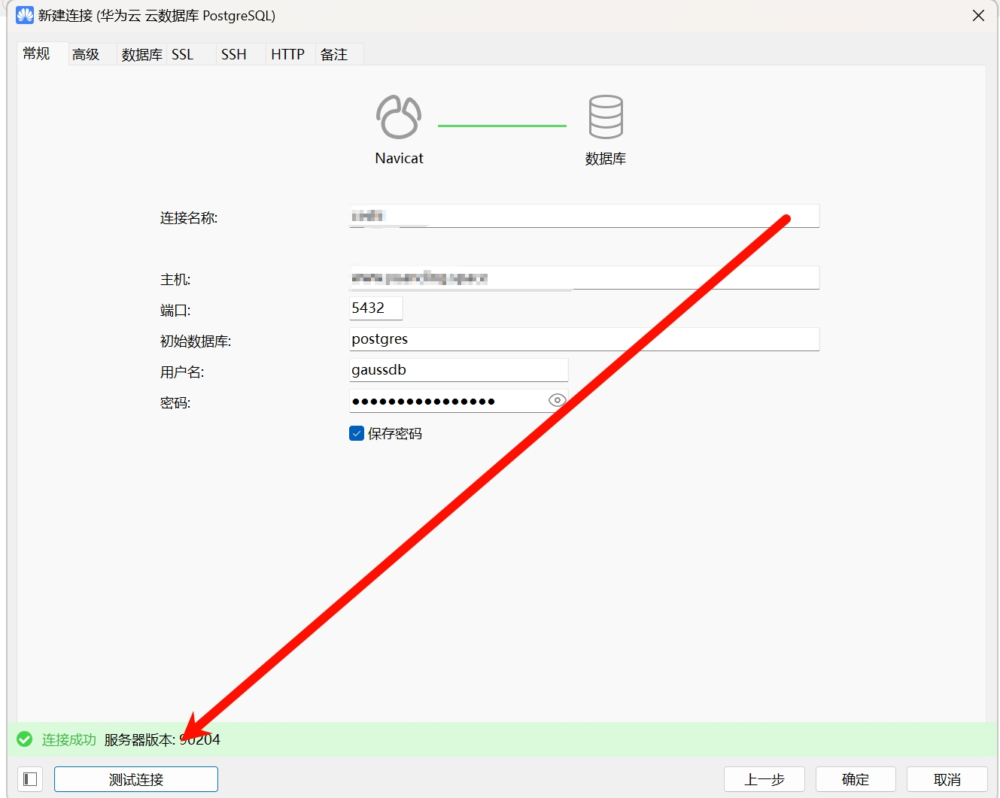

这里以Navicat为例：

点击连接，选择PostgreSql，选择华为云数据库，点击下一步。

连接名称根据自己的需要取，主机名是自己的服务器地址，端口默认5432如果自己部署的时候改变了端口，需要填写修改后的，

用户名默认gaussdb，密码是自己设置的。

填写完整后点击测试连接，查看是否能测试通过。

与gauss建立连接后，右键命令界面，create database 库名 dbcompatibility = 'B';要用B模式创建

B模式是 dolphin 插件带来 用于支持 MySQL 兼容性模式 ，创建的库不是B模式要重新创建

创建完数据库后，右键创建的数据库选择新建模式，按照步骤填写，完成创建。

