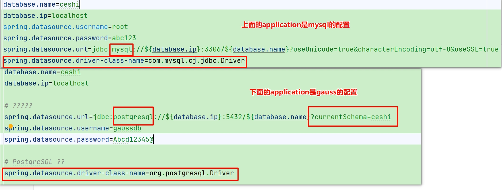
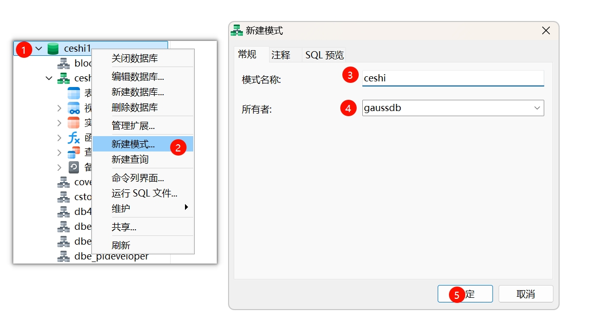

##  在application中配置



红框是需要注意要改的地方

```
database.name=数据库名
database.ip=服务器ip地址
spring.datasource.url=jdbc:postgresql://${database.ip}:5432/${database.name}?currentSchema=架构名/模式名
spring.datasource.username= #数据库用户名
spring.datasource.password= #数据库密码

#PostgreSQL 驱动
spring.datasource.driver-class-name=org.postgresql.Driver
```

 **currentSchema的意思就是指定默认查找路径**

 **可以指定多个，中间用逗号分隔，如：spring.datasource.url=jdbc:postgresql://${database.ip}:5432/${database.name}?currentSchema=ceshi,ceshi1**



**currentSchema后跟的是这个新建模式中的   模式名称**

 不同的连接会话可以设置不同的 `currentSchema`，互不干扰。 有会话级别的隔离

如果不指定，通常会去public中查找数据

## 添加pom依赖

```
	<--PostgreSQL驱动-->
<dependency>
 <groupId>org.postgresql</groupId>
 <artifactId>postgresql</artifactId>
 <version>42.7.4</version>
</dependency>
```

​    